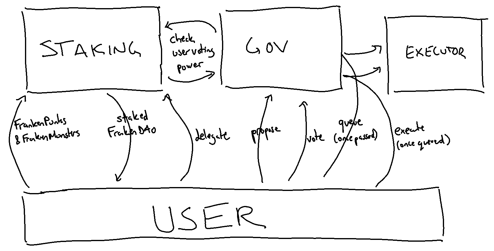

# FrankenDAO

## Description

FrankenDAO is the staking and governance component of the FrankenPunks
ecosystem. The DAO will have full control over the FrankenPunks treasury.

The basic user flow for the DAO is as follows:
- Holders of FrankenPunks or FrankenMonsters can stake their NFTs
- They will receive stakedFrankenDAO NFTs in return, which retain their token's ID and characteristics
- Stakers will earn votes based on the length of time they stake, the uniqueness of their NFT, and their involvement in the DAO
- Stakers can use this voting power to propose and vote on proposals
- Alternatively, they can delegate their votes to another user
- Proposals that receive sufficient votes from the community will be permissionalessly executed

The DAO implementation draws heavily from NounsDAO, with deviations described in the contracts.

# Architecture

```
├── Executor.sol
├── Governance.sol
├── Staking.sol
├── errors
│   └── FrankenDAOErrors.sol
├── interfaces
│   ├── IAdmin.sol
│   ├── IERC721.sol
│   ├── IExecutor.sol
│   ├── IGovernance.sol
│   ├── IRefundable.sol
│   └── IStaking.sol
├── proxy
│   └── GovernanceProxy.sol
└── utils
    ├── Admin.sol
    ├── Refundable.sol
    └── SafeCast.sol
```

| Contract | Description | 
| --- | ---  |
| `Staking.sol`  | Contract for staking FrankenPunks and FrankenMonsters, delegating, and calculating voting power  |
| `Governance.sol`  | Creating and voting on proposals or queuing the transactions defined in a passed proposal  |
| `Executor.sol`  | Treasury for holding DAO funds and executing the transactions of approved proposals  |
| `Admin.sol`  | Admin roles and permission checks for contracts. Defines roles for founders, commmunity council, the executor contract, and a pauser. |
| `Refundable.sol`  | Contract for shared functionality for refunding gas on certain methods. Used to refund staking, delegating, creating proposals, and voting  |
| `GovernanceProxy.sol`  | ERC1967 proxy for Governance upgradeability (based on Open Zeppelin's implementation with a few changes)  |

# System Overview

Here is a simplified overview of the major actions user's take in the system:



# Contracts
## Staking

The Staking contract accepts ownership of FrankenPunks and FrankenMonsters and
mints a corresponding stakedFrankenDAO token -- a non-transferrable NFT.

### FrankenPunks and FrankenMonsters

FrankenPunk token IDs begin at 0 and continue through 9,999. FrankenMonster token IDs begin at 10,000 and continue through 20,010. Conveniently, this allows each stakedFrankenDAO token to mirror the ID of the underlying token.

FrankenPunks will earn voting power at 2X the rate that FrankenMonsters do (see below for voting power formula).

### Staking and Unstaking Tokens

Users can stake their tokens to receive FrankenDAO tokens. 

Staking is allowed unless it is paused at the contract level. 

When users stake their tokens, they commit to an `unlockTime` for an additional staking bonus. They can set the time to 0 to receive no bonus (which allows them to unlock at any time) or commit to an unlock time in the future for larger rewards.
### Voting Power

The system is divided into two distinct types of Voting Power.

1. Token Voting Power are the votes you earn through staking your tokens. This is calculated as follows:

`Token Voting Power = (Base Votes + Staking Bonus + Evil Bonus) * (Monster Multiplier / 100)`

- Base Votes is a number set at the contract level. It will be initialized to 20.
- Staking Bonus is calculated when tokens are staked. It is awarded linearly based on the formula `(unlockTime - block.timestamp) / maxStakeBonusTime * maxStakeBonusAmount`. In other words, you can earn `maxStakeBonusAmount` if you stake for `maxStakeBonusTime` and `0` if you stake for no time, and rewards are added linearly between these points. These values will be initialized to `20` and `4 weeks`.
- Evil Bonus is a bonus for FrankenPunks stakers whose underlying tokens have specific traits. The bitmap of users who have sufficient "evil score" to get this bonus is stored in `EVIL_BITMAPS` and accessed to determine whether a specific ID should get the bonus. This value will be initialized to 10.


2. Community Voting Power are the additional votes you earn by being an active participant in the DAO. This is calculated as follows:

`Community Voting Power = ((# Votes * votesMultiplier / 100) + (# Proposals Verified * proposalsCreatedMultiplier / 100) + (# Proposals Passed * proposalsPassedMultiplier / 100))`

- votesMultiplier, proposalsCreatedMultiplier, and proposalsPassedMultiplier are all values that can be set by governance to adjust the importance of these actions. They will be initialized to 100, 200, and 200, meaning users will earn 1 additional vote per vote they cast, 2 votes per proposal they get on chain, and 2 votes per proposal they get passed.
- A user will only earn Community Voting Power if they have _some_ Token Voting Power. In other words, if a user has delegated their votes, or doesn't have any tokens staked or votes delegated to them, they have no voting power, and they therefore forfeit their community power. 
- Users who delegate their votes to others therefore delegate only their Token Voting Power, and their Community Voting Power is temporarily forfeited (until they undelegate their votes).

### Locking Tokens

Most governance systems (including Nouns) use some form of checkpointing to capture each user's voting power at the time of a proposal, to stop users from "double spending" their tokens on votes.

In order to improve gas efficiency, we've implemented a different system. 
- When a user's votes are used on a proposal (whether through voting directly, having a delegate vote, proposing the proposal directly, or having a delegate propose a proposal), their tokens are locked until that proposal is no longer active.
- Since FrankenDAO tokens are non-transferrable, we simply block the ability to unstake or delegate, and that ensures that users must hold their tokens once they've "used" them on an active proposal.
## Governance

The governance system is a modified fork of NounsDAO. Actions like creating a proposal, casting a vote, and queueing a passed proposal all occur on Governance.sol, which is behind a proxy
(GovernanceProxy.sol). 

Transactions in approved proposals are queued to Executor.sol, where are are subject to a time lock. Just like in Nouns, thresholds for proposing and reaching quorum are calculated on a proposal-by-proposal basis through basis-points of the total voting power in the system. We've implemented mechanisms to track the total Community Voting Power and Token Voting Power in order to make these calculations accurate and efficient.

## Executor

The Executor contract is where transactions are locked for a window of time
before they can be executed. The Executor is never called directly (except for a view function) -- it is always called by governance to execute on proposals that have already been passed.

Architecturally, this is similar to Nouns and Bravo, with just a few minor modifications.

## Governance Proxy

In order to allow Governance upgradeability, Governance lives behind a proxy. We use [EIP 1967](https://eips.ethereum.org/EIPS/eip-1967). Our Proxy is similar to OpenZeppelin's `TransparentUpgrardeableProxy` but with a few slight modifications:

- we allow Admin to access the fallback function (so that Executor can call functions in Governance)
- we change ifAdmin modifier to onlyAdmin, reverting vs fallback if non admin calls a proxy function
- we open up non admin ability to access proxy view functions to check admin() and implementation()

## Admin

This contract is where we manage the four roles shared across our Governance and
Staking and where we implement modifiers for checking those roles. The four
roles are:

1. `founders`, a multi-sig of the project's founders
2. `council`, a multi-sig of appointed community members
3. `executor`, the current implementation of Executor
4. `pauser`, an EOA address with permission only to pause the Staking contract

## Refundable

This contract is for shared functionality of refunding transactions. It
is implemented by Staking and Governance, with the following functions being
refundable:

1. Proposing
2. Voting
3. Staking
4. Delegating

Each of these contracts has a `setRefunds()` function that allows Governance to turn refunding on and off at the function level. All refunds will start as true and the founders will contribute 5 ETH to each of the two contracts for gas refunds. When this pool runs out, the community will decide whether to keep refunds on and refill the contracts, or turn them off.

# Known Risks

There are a number of "risks" we are aware of and which will not be valid for the contest:

1. No Zero Address Checks™. I'm serious. [See frangio's thoughts here](https://forum.openzeppelin.com/t/removing-address-0x0-checks-from-openzeppelin-contracts/2222) if you want a history on why these make no sense.


2. We know the system has some centralization. Currently, the DAO is operating from a multisig, and this system is a step towards decentralization. Specifically, we're aware that:
- Proposals could be blocked by not verifying them
- Proposals could be vetoed
- Staking could be paused to keep users out

We've added logic to the contracts to be able to continue decentralization in the future, by renouncing the founder multisig (leaving only the commnunity multisig). We may remove verification, vetoing, and pausing entirely in the future, which would require upgrading the contract.

3. We know we could deploy with the wrong parameters, but we're not planning to. You can look at our final deployment script in `script/Deploy.s.sol`. If there is an issue that will could from running that script, please consider that a valid finding. If there is a hypothetical issue that could come if we deployed in a different way, please don't feel the need to report it.

4. We are aware that there are no storage gaps in the contracts inherited by our upgradeable contract. This is generally not best practice but we've chosen to do so because (a) Refundale uses no storage and (b) Admin storage will not be changed or expanded in the case of an upgrade.

# Testing Setup

FrankenDAO runs on [Foundry](https://book.getfoundry.sh/). 

To install Foundry (assuming a Linux or macOS System):

`curl -L https://foundry.paradigm.xyz | bash`

This will download foundryup. To start Foundry, run:

`foundryup`

To install dependencies:

`forge install`

Because our contracts interact with the live Frankenpunks and Frankenmonsters contracts, all tests require forking Ethereum mainnet.

To add your RPC_URL for mainnet forking, open `foundry.toml` and add the following:

```
[rpc_endpoints]
mainnet = "https://mainnet.infura.io/v3/324422b5714843da8a919967a9c652ac"
```

To run tests:

`forge test`

See the [Foundry Book](https://book.getfoundry.sh/) for more on Foundry.

# Team & Contacts

We're here to make this test as smooth as possible for you. Ask lots of questions, and let us know if the documentation or system is unclear in any way.

We'll all be in the Discord with DMs open.

- dev: @zachobront#1010
- dev: @zakk | Cabin#0896
- team: @DobsGaming#6670
- team: @CESS#0720
- team: @TrackerNFT#0230